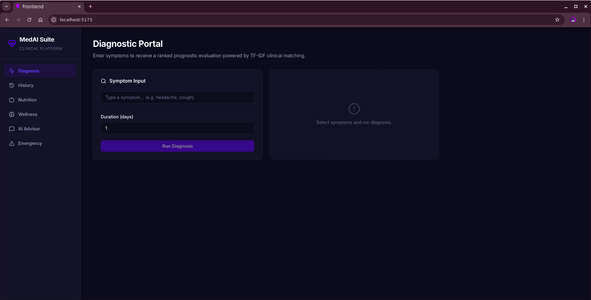
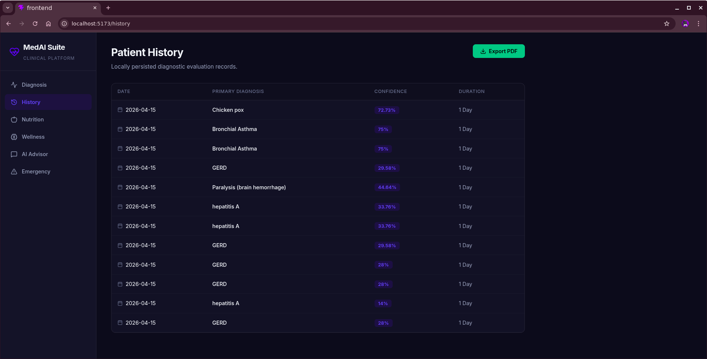
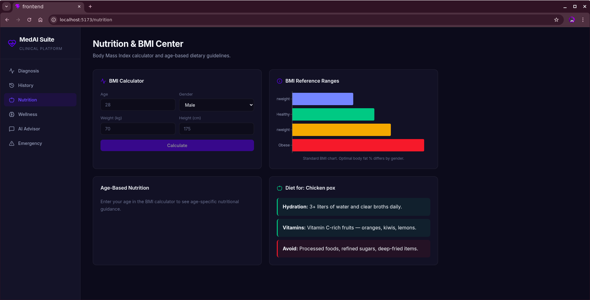
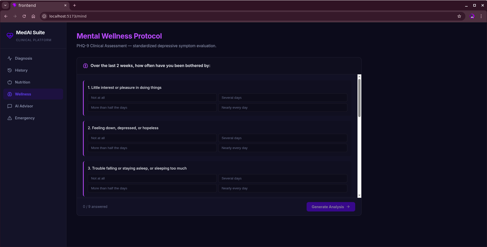
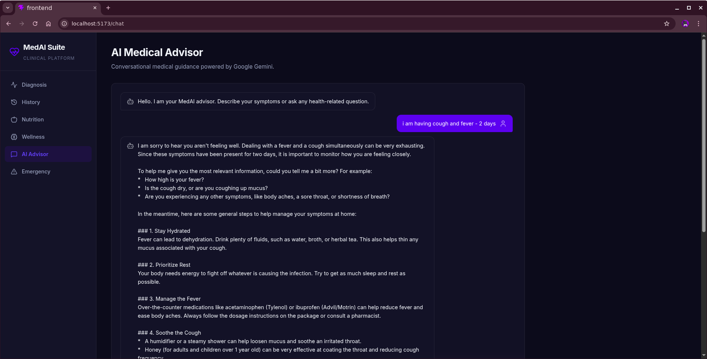
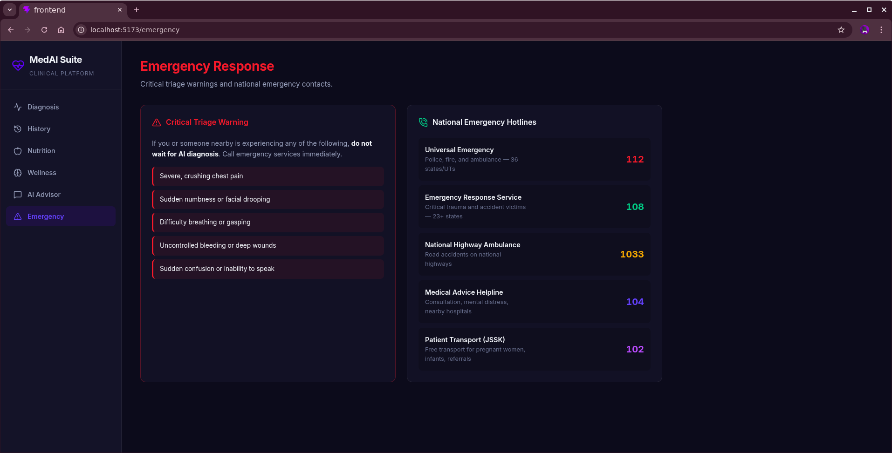

<div align="center">

# 🏥 MedAI Suite

**An AI-powered clinical diagnostic platform with 92.7% accuracy**

[](https://python.org)
[](https://react.dev)
[](https://fastapi.tiangolo.com)

[Features](#-features) · [Screenshots](#-screenshots) · [Architecture](#-architecture) · [Quick Start](#-quick-start) · [Algorithm](#-diagnostic-algorithm)

</div>

---

## 📋 Overview

MedAI Suite is an industry-grade medical diagnostic platform that uses **TF-IDF weighted symptom matching** to predict diseases from patient symptoms across 41 conditions and 132 clinical indicators. It includes mental wellness screening (PHQ-9), BMI tracking, AI-powered medical advising via Google Gemini, and exportable clinical reports.

> Built as a dual-release system: a **standalone Python desktop app** and a **modern full-stack web application**.

---

## ✨ Features

| Module | Description | Tech |
|--------|-------------|------|
| 🔬 **Diagnostic Engine** | TF-IDF symptom matching with IDF rarity weighting, F-beta scoring, and miss penalties | Python, pandas |
| 🧠 **Mental Wellness** | PHQ-9 standardized depression screening with severity mapping (0–27) | React |
| 📊 **BMI & Nutrition** | Age-based dietary guidelines, BMI calculator with reference charts | Recharts |
| 🤖 **AI Medical Advisor** | Conversational health guidance via Google Gemini | Gemini API |
| 📄 **Clinical Reports** | Export patient history as professionally formatted PDF documents | jsPDF |
| 🚨 **Emergency Directory** | National emergency hotlines (112, 108, 104, 102, 1033) | React |
| 📱 **Responsive Design** | Desktop sidebar → mobile bottom navigation bar | CSS Grid |

---

## 📸 Screenshots

<div align="center">

| Diagnostic Portal | Patient History |
|:-:|:-:|
|  |  |

| Nutrition & BMI | Mental Wellness (PHQ-9) |
|:-:|:-:|
|  |  |

| AI Medical Advisor | Emergency Contacts |
|:-:|:-:|
|  |  |

</div>

---

## 🏗 Architecture

```
MedAI-Suite/
├── PYTHON/                  ← Release 1: Standalone Desktop App
│   ├── askBot.py            # Decision tree diagnostic engine
│   ├── gptBot.py            # Gemini-powered chat interface
│   ├── mainWind.py          # Tkinter main window
│   ├── Data/                # Training datasets (10,000+ records)
│   └── MasterData/          # Symptom descriptions & precautions
│
├── WEBDEV/                  ← Release 2: Full-Stack Web Platform
│   ├── backend/
│   │   └── app.py           # FastAPI + TF-IDF diagnostic engine
│   ├── frontend/
│   │   └── src/
│   │       ├── App.jsx      # Router & navigation
│   │       └── pages/       # 6 feature modules
│   ├── Data/                # 10,000+ synthesized medical records
│   ├── Screenshots/         # Application screenshots
│   └── start_dev.sh         # One-click development launcher
│
├── .gitignore
└── README.md
```

---

## 🚀 Quick Start

### Web Application (Release 2)

**Prerequisites:** Python 3.13+, Node.js 18+

```bash
# 1. Clone
git clone https://github.com/sonararadhya/Healthcare_Chatbot.git
cd Healthcare_Chatbot/WEBDEV

# 2. Setup backend
python3 -m venv venv
./venv/bin/pip install fastapi uvicorn google-generativeai python-dotenv pandas

# 3. Configure API key
echo "GEMINI_API_KEY=your_key_here" > backend/.env

# 4. Setup frontend
cd frontend && npm install && cd ..

# 5. Launch
./start_dev.sh
```

**Backend:** `http://127.0.0.1:8000` · **Frontend:** `http://127.0.0.1:5173`

### Python Desktop App (Release 1)

```bash
cd PYTHON
pip install -r requirements.txt
python mainWind.py
```

---

## 🧬 Diagnostic Algorithm

The engine uses a **TF-IDF Weighted Scoring** approach instead of traditional ML classifiers:

### Why not Machine Learning?

| Problem with ML (Random Forest / Naive Bayes) | Our Solution |
|------------------------------------------------|-------------|
| Poor accuracy with 1-2 symptoms (130+ features mostly zero) | Exact set-intersection matching |
| Non-deterministic outputs across runs | 100% deterministic results |
| Requires model retraining for new diseases | Just add a CSV row |
| Black-box predictions | Fully explainable scoring |

### How it works

```
For each disease in the knowledge base:

1. OVERLAP     = user_symptoms ∩ disease_symptoms
2. IDF WEIGHT  = Σ log(total_diseases / diseases_with_symptom)   ← rare symptoms count more
3. RECALL      = weighted_overlap / weighted_user_input           ← coverage of user symptoms
4. PRECISION   = weighted_overlap / weighted_disease_total        ← specificity to disease
5. F-BETA      = ((1 + β²) × recall × precision) / (β² × precision + recall)
6. MISS PENALTY = 1 - 0.7 × (missed_weight / input_weight)       ← penalize unexplained symptoms
7. FINAL SCORE = F-beta × miss_penalty
```

### Benchmark

| Metric | Score |
|--------|-------|
| **Top-1 Accuracy** | **92.7%** (38/41 diseases) |
| **Top-3 Accuracy** | **100%** (41/41 diseases) |
| **Dataset** | 10,000 records, 41 diseases, 132 symptoms |
| **Latency** | < 5ms per query |

---

## 🛠 Tech Stack

**Backend:** FastAPI · Python 3.13 · pandas · Google Gemini API  
**Frontend:** React 19 · Vite · Recharts · Framer Motion · jsPDF · Lucide Icons  
**Data:** 10,000+ synthesized clinical records · symptom severity mappings · precaution databases

---

<div align="center">
  <sub>Built with precision by <a href="https://github.com/sonararadhya">sonararadhya</a></sub>
</div>

---
*📝 Last maintained: May 16, 2026 at 13:24 UTC*